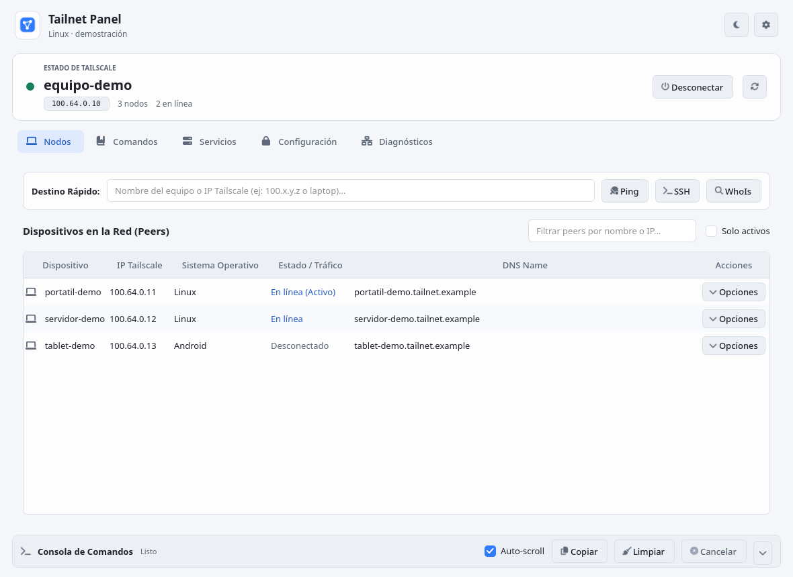
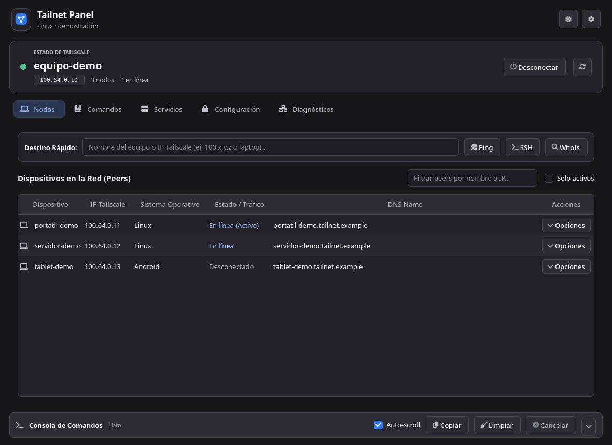

# Tailnet Panel - Aplicación Nativa en Qt Multiplataforma

[English](README.en.md)

**Tailnet Panel** es una interfaz gráfica de escritorio construida con **Qt (PyQt6)** para la CLI de Tailscale. Es un proyecto comunitario independiente: no está afiliado ni respaldado por Tailscale Inc.

Reúne **115 entradas en [comandos.md](comandos.md)** en vistas especializadas y un catálogo con búsqueda, formularios y consola integrada. La disponibilidad de cada comando depende de la versión de Tailscale y del sistema operativo.

El código se ha probado en Linux con Python 3.14. Hay rutas para Windows y macOS, pero todavía no se han verificado en integración continua en esos sistemas.

| Tema claro | Tema oscuro |
| --- | --- |
|  |  |

Las capturas usan datos ficticios.

---

## Características Principales

- **Catálogo de comandos:** 115 entradas documentadas en `comandos.md`, con vistas dedicadas y un catálogo con búsqueda.
- **Interfaz unificada:** Temas oscuro y claro con paleta centralizada, controles reutilizables, iconos y estados de interacción adaptados a cada tema, estado compacto y consola plegable.
- **Terminal integrada:** Visualización asíncrona de la salida de comandos (`stdout` y `stderr`) sin congelar la ventana, con opciones para copiar, limpiar, auto-scroll y cancelar procesos. La salida de comandos que reciben secretos se muestra al terminar, después de ocultarlos.
- **Estado sin bloqueos:** Una consulta periódica asíncrona actualiza las vistas que muestran el estado. El intervalo y la actualización automática se configuran en Opciones.
- **Permisos en Linux:** Detecta si el usuario es operador de Tailscale y ejecuta los comandos admitidos sin diálogos repetidos. Algunas operaciones del sistema todavía pueden solicitar autorización mediante `pkexec`.
- **Claves de autenticación:** El panel oculta las claves en vistas previas, consola e historial. Al ejecutar `login` o `up`, pasa la clave al CLI mediante un archivo temporal privado y lo elimina al finalizar.
- **Soporte para Socket Personalizado:** Posibilidad de indicar un socket alternativo (`--socket=<path>`) de forma global.
- **Bandeja del sistema:** Menú rápido para conectar, desconectar o abrir el panel.

---

## Módulos y Vistas Disponibles

| Vista | Comandos Cubiertos | Funcionalidad |
| :--- | :--- | :--- |
| **📊 Dashboard & Peers** | `#1`, `#2`, `#86-89`, `#36-39`, `#108-111` | Estado en tiempo real, IPs, MagicDNS, control Up/Down, Whoami, Whois y tabla de peers con acciones directas. |
| **⚙️ Preferencias** | `#32-35`, `#76-83`, `#93-94` | Gestión rápida de `accept-routes`, `hostname`, `shields-up`, `ssh`, visor jerárquico de `get all` y políticas del sistema. |
| **🛡️ Exit Nodes** | `#23`, `#24`, `#78`, `#80-81` | Lista de nodos de salida, sugerencia automática del nodo óptimo y anuncio del equipo como Exit Node. |
| **🌐 Diagnósticos** | `#3`, `#5-6`, `#53-56`, `#57`, `#58-61` | Netcheck gráfico (latencias DERP, NAT, UDP), Ping continuo (`--until-direct`, `--icmp`, `--tsmp`), Netcat y pruebas DNS. |
| **🚀 Serve & Funnel** | `#28-31`, `#62-75` | Publicación de servicios en red privada (`serve`) o hacia Internet (`funnel`), HTTP/HTTPS/TCP, configuración declarativa JSON y servicios HA. |
| **📁 Archivos** | `#7-10`, `#25-27` | Transferencia P2P con Taildrop (enviar/recibir) y gestión de carpetas compartidas con Taildrive (compartir, renombrar, unshare). |
| **🔑 Tailscale SSH** | `#82`, `#84-85` | Activación del servidor SSH en el equipo y conexión remota interactiva con lanzamiento de terminal. |
| **🔒 Seguridad & Lock** | `#4`, `#41-49` | Generación de certificados Let's Encrypt para MagicDNS y gestión completa de claves, firmas y logs de Tailnet Lock. |
| **👤 Cuentas & Switch** | `#50-52`, `#90-92` | Cambio rápido entre cuentas configuradas (Fast User Switching), inicio con Auth Key y cierre de sesión. |
| **📡 App Connector** | `#112-115` | Monitorización de rutas, dominios aprendidos y conteo total de políticas de App Connector. |
| **🛠️ Sistema & OS** | `#11-22`, `#40`, `#95-104` | Integración con Kubeconfig, Synology, macOS VPN/Sysext, Systray Linux, autocompletado shell (Bash, Zsh, Fish, PS) y actualizaciones de versión. |
| **📚 Los 115 Comandos** | **#1 al #115** | Explorador maestro con buscador universal, filtro por categoría, formulario modal de parámetros y ejecución directa. |

---

## Requisitos e Instalación

### Requisitos Previos
- **Python 3.10+** (probado con Python 3.14 en Linux).
- **Tailscale** instalado y su CLI disponible en el `PATH`. El panel no incluye Tailscale.

### Linux / macOS

```bash
python3 -m venv .venv
. .venv/bin/activate
python -m pip install -r requirements.txt
./run.sh
```

### Windows

En PowerShell o CMD:

```bat
py -3 -m venv .venv
.\.venv\Scripts\python.exe -m pip install -r requirements.txt
.\run.bat
```

Si mueves la carpeta del proyecto, vuelve a crear el entorno virtual.

---

## Permisos y ejecución

### Permisos en Linux

Tailscale ejecuta su daemon con privilegios. Para administrar el daemon desde el panel con tu cuenta normal, registra tu usuario como operador una sola vez:

~~~bash
sudo tailscale set --operator="$USER"
tailscale get operator
~~~

También puedes usar **Habilitar permisos** en la pantalla principal. Después, vuelve a abrir el panel. Las operaciones que modifican la instalación de Tailscale o el sistema pueden seguir solicitando autorización. Ejecuta la aplicación con tu usuario normal.

### Acceso directo Linux

Después de instalar las dependencias, registra un acceso directo para tu usuario:

```bash
python3 install_desktop.py
```

El script genera las rutas para la ubicación actual del proyecto y sustituye el acceso directo anterior de este mismo proyecto. Si lo mueves, ejecútalo de nuevo. Para quitar el acceso directo: `python3 install_desktop.py --uninstall`.

---

## Pruebas

En Linux, sin abrir una ventana:

```bash
QT_QPA_PLATFORM=offscreen .venv/bin/python -m unittest discover -s tests -v
```

`test_app.py` hace además consultas de solo lectura a una instalación local de Tailscale; no se ejecuta en CI.

---

## Compilación de un ejecutable

Construye en el mismo sistema operativo para el que distribuirás el ejecutable. PyInstaller no compila de forma cruzada:

```bash
python -m pip install -r requirements-build.txt
python build_executable.py
```

El resultado queda en `dist/` y requiere que Tailscale esté instalado en el equipo de destino. En Linux, compila en la distribución más antigua que quieras admitir, porque [PyInstaller no incluye glibc](https://www.pyinstaller.org/en/stable/usage.html#making-gnu-linux-apps-forward-compatible). Al distribuir binarios, incluye el código fuente y los avisos de [licencias de terceros](THIRD_PARTY_NOTICES.md). La compilación se ha verificado en Linux; Windows y macOS requieren pruebas propias antes de publicar sus binarios.

---

## Estructura del Proyecto

```
Tailnet Panel/
├── app/
│   ├── main.py                     # Punto de entrada de la aplicación Qt
│   ├── config.py                   # Ajustes persistentes y detección multiplataforma
│   ├── core/
│   │   ├── command_registry.py     # Registro tipado de los 115 comandos de Tailscale
│   │   ├── async_query.py          # Consultas de solo lectura sin bloquear la interfaz
│   │   ├── runner.py               # Ejecutor asíncrono y protección de secretos
│   │   └── tailscale_client.py     # Consultas JSON y helpers del estado del tailnet
│   └── ui/
│       ├── theme.py                # Paleta y estilos QSS compartidos
│       ├── main_window.py          # Ventana principal, navegación y System Tray
│       ├── components/             # Controles compartidos, tablas, TerminalPanel, StatCard, CommandDialog
│       └── views/                  # 12 vistas funcionales especializadas
├── test_app.py                     # Suite de pruebas automatizadas
├── tests/test_findings.py          # Regresiones de seguridad y consultas asíncronas
├── tests/test_ui_feedback.py       # Temas, controles y adaptación de tablas
├── build_executable.py             # Script de compilación PyInstaller
├── install_desktop.py              # Instalador de acceso directo Linux por usuario
├── run.sh                          # Lanzador para Linux/macOS
├── run.bat                         # Lanzador para Windows
├── SECURITY.md                     # Reporte de problemas de seguridad
├── CONTRIBUTING.md                 # Guía para contribuir
├── THIRD_PARTY_NOTICES.md          # Dependencias y marcas de terceros
└── comandos.md                     # Referencia de comandos fuente
```

## Licencia

El código de Tailnet Panel se distribuye bajo [GPL-3.0-only](LICENSE). Las dependencias y marcas de terceros mantienen sus propias condiciones, descritas en [THIRD_PARTY_NOTICES.md](THIRD_PARTY_NOTICES.md).
